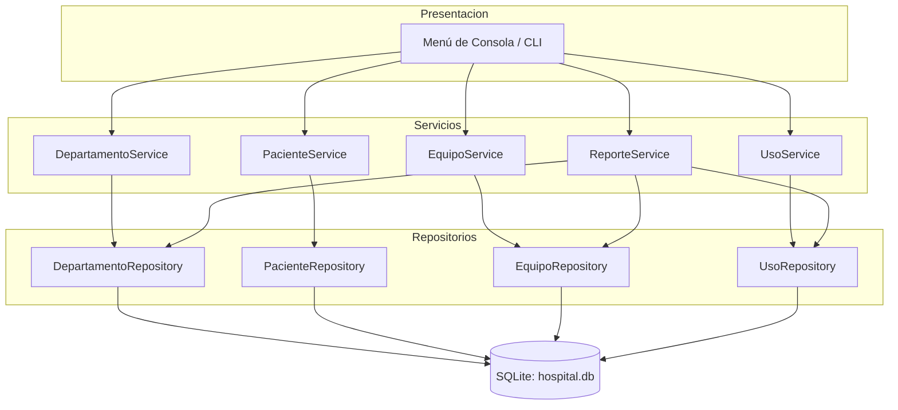
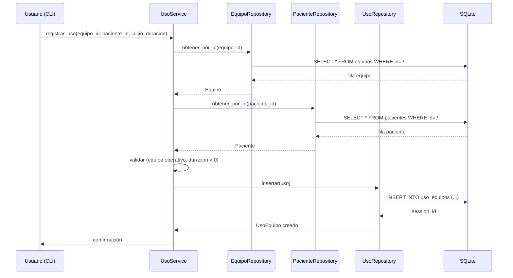
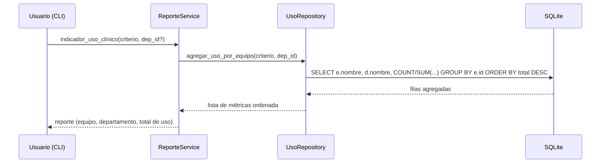
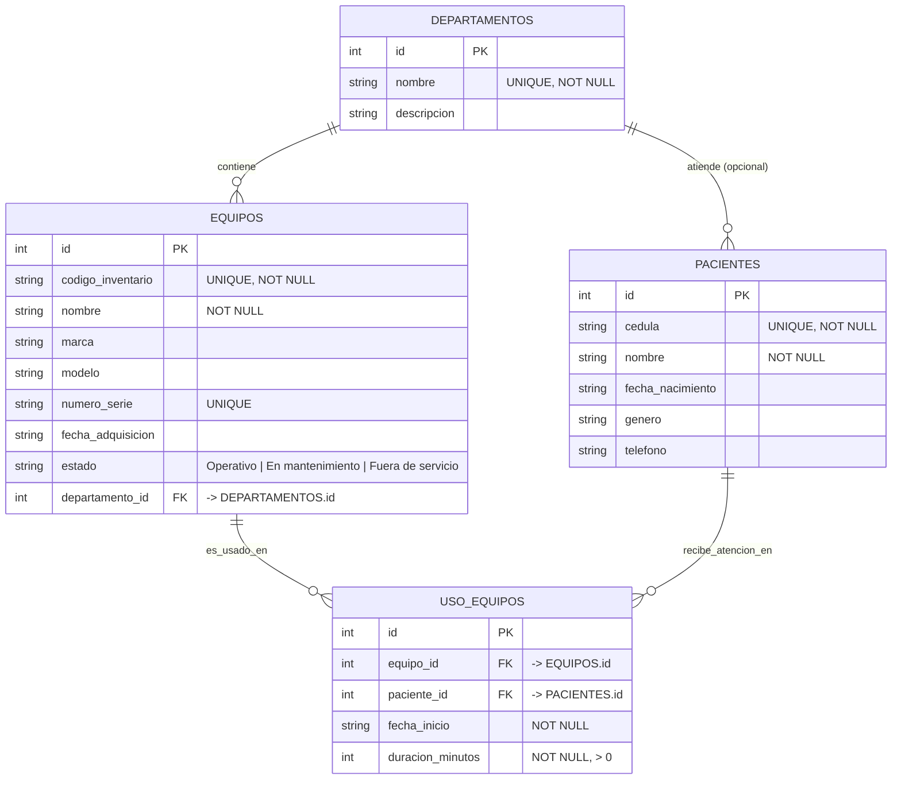

# Documento de Diseño: Sistema de Gestión de Equipos Médicos — Hospital Santo Tomás

## Overview (Visión General)

El **Sistema de Gestión de Equipos Médicos del Hospital Santo Tomás** es una aplicación local desarrollada en **Python** conectada a una base de datos relacional (**SQLite**) que permite controlar, registrar y dar mantenimiento al inventario de equipos médicos, así como registrar las sesiones de uso de dichos equipos por parte de los pacientes.

El sistema se organiza en cuatro dominios funcionales: (1) gestión de departamentos y pacientes, (2) gestión del inventario de equipos médicos, (3) control de sesiones de uso, y (4) un módulo de consultas avanzadas y reportes de métricas. El requisito crítico del proyecto es el **Indicador de Uso Clínico**, un reporte que analiza el historial de sesiones para determinar cuál es el equipo médico más utilizado por los pacientes, calculado por número de sesiones o por horas acumuladas de uso, clasificado por departamento.

La arquitectura sigue un patrón en capas (Presentación → Servicios → Repositorios → Base de Datos) que separa la lógica de negocio del acceso a datos y de la interfaz de consola, favoreciendo el mantenimiento, la testeabilidad y el cumplimiento de las reglas de integridad referencial exigidas por el proyecto. Se decidió usar **SQLite** por ser una base de datos relacional embebida que no requiere un servidor externo, ideal para una aplicación local, cumpliendo a la vez con el requisito de claves primarias y foráneas.

## Architecture (Arquitectura)

La aplicación utiliza una **arquitectura en capas** que aísla responsabilidades:

- **Capa de Presentación (CLI):** menú de texto en consola que captura las opciones del usuario y muestra resultados formateados.
- **Capa de Servicios (Lógica de Negocio):** valida datos, aplica reglas del dominio y coordina operaciones (ej. cálculo del indicador de uso clínico).
- **Capa de Repositorios (Acceso a Datos):** encapsula todas las sentencias SQL y traduce entre filas de la base de datos y objetos del dominio.
- **Base de Datos (SQLite):** almacena de forma persistente los departamentos, pacientes, equipos y sesiones de uso con integridad referencial.



### Estructura de Módulos (Organización del Proyecto)

```text
hospital_equipos/
├── main.py                  # Punto de entrada; inicia el menú
├── db/
│   ├── conexion.py          # Gestión de la conexión SQLite
│   └── esquema.sql          # DDL: creación de tablas + PK/FK
├── modelos/
│   ├── departamento.py      # Dataclass Departamento
│   ├── paciente.py          # Dataclass Paciente
│   ├── equipo.py            # Dataclass Equipo + Enum EstadoEquipo
│   └── uso.py               # Dataclass UsoEquipo
├── repositorios/
│   ├── departamento_repo.py
│   ├── paciente_repo.py
│   ├── equipo_repo.py
│   └── uso_repo.py
├── servicios/
│   ├── departamento_service.py
│   ├── paciente_service.py
│   ├── equipo_service.py
│   ├── uso_service.py
│   └── reporte_service.py
└── cli/
    └── menu.py              # Menú de texto interactivo
```

## Sequence Diagrams (Diagramas de Secuencia)

### Flujo 1: Registrar una sesión de uso de equipo



### Flujo 2: Generar el Indicador de Uso Clínico (requisito crítico)



## Components and Interfaces (Componentes e Interfaces)

### Componente 1: DepartamentoService

**Propósito:** Gestionar el registro y consulta de los 12 departamentos del hospital.

**Interfaz:**
```python
class DepartamentoService:
    def registrar(self, nombre: str, descripcion: str) -> Departamento: ...
    def listar(self) -> list[Departamento]: ...
    def obtener(self, departamento_id: int) -> Departamento | None: ...
    def inicializar_departamentos_base(self) -> None:
        """Precarga los 12 departamentos si la tabla está vacía."""
```

**Responsabilidades:**
- Validar que el nombre del departamento no esté vacío ni duplicado.
- Precargar los 12 departamentos definidos del hospital.

### Componente 2: PacienteService

**Propósito:** Registrar y consultar pacientes con todos sus datos principales.

**Interfaz:**
```python
class PacienteService:
    def registrar(self, cedula: str, nombre: str, fecha_nacimiento: str,
                  genero: str, telefono: str) -> Paciente: ...
    def listar(self) -> list[Paciente]: ...
    def obtener(self, paciente_id: int) -> Paciente | None: ...
```

**Responsabilidades:**
- Validar la unicidad de la cédula/identificación del paciente.
- Validar formato de fecha de nacimiento y campos obligatorios.

### Componente 3: EquipoService

**Propósito:** Gestionar el ciclo de vida del inventario de equipos médicos (alta, actualización, baja).

**Interfaz:**
```python
class EquipoService:
    def registrar(self, codigo_inventario: str, nombre: str, marca: str,
                  modelo: str, numero_serie: str, fecha_adquisicion: str,
                  estado: EstadoEquipo, departamento_id: int) -> Equipo: ...
    def actualizar(self, equipo_id: int, **campos) -> Equipo: ...
    def cambiar_estado(self, equipo_id: int, nuevo_estado: EstadoEquipo) -> Equipo: ...
    def dar_de_baja(self, equipo_id: int) -> None: ...
    def listar_por_departamento(self, departamento_id: int) -> list[Equipo]: ...
    def listar_en_mantenimiento(self) -> list[Equipo]: ...
```

**Responsabilidades:**
- Garantizar que el `codigo_inventario` sea único.
- Validar que el departamento asignado exista (integridad referencial).
- Restringir la transición de estados a los tres valores válidos.

### Componente 4: UsoService

**Propósito:** Registrar cada sesión de uso de un equipo por un paciente.

**Interfaz:**
```python
class UsoService:
    def registrar_uso(self, equipo_id: int, paciente_id: int,
                      inicio: str, duracion_minutos: int) -> UsoEquipo: ...
    def listar_por_equipo(self, equipo_id: int) -> list[UsoEquipo]: ...
```

**Responsabilidades:**
- Validar que el equipo y el paciente existan.
- Validar que la duración sea un valor positivo.

### Componente 5: ReporteService (Módulo de Métricas)

**Propósito:** Producir consultas avanzadas y reportes, incluido el Indicador de Uso Clínico.

**Interfaz:**
```python
class ReporteService:
    def inventario_por_departamento(self, departamento_id: int) -> list[Equipo]: ...
    def alerta_mantenimiento(self) -> list[Equipo]: ...
    def indicador_uso_clinico(self, criterio: CriterioUso,
                              departamento_id: int | None = None
                              ) -> list[MetricaUso]: ...
```

**Responsabilidades:**
- Agregar el historial de sesiones por equipo.
- Ordenar de mayor a menor según el criterio (número de sesiones u horas acumuladas).
- Devolver nombre del equipo, su departamento y el total de uso.

## Data Models (Modelos de Datos)

### Diagrama Entidad-Relación (DER / ERD)

> Requisito explícito del proyecto: se presenta el modelo relacional con un mínimo de 4 tablas aplicando integridad referencial (claves primarias y foráneas).



### Esquema Relacional (DDL SQLite)

```sql
PRAGMA foreign_keys = ON;

CREATE TABLE IF NOT EXISTS departamentos (
    id          INTEGER PRIMARY KEY AUTOINCREMENT,
    nombre      TEXT NOT NULL UNIQUE,
    descripcion TEXT
);

CREATE TABLE IF NOT EXISTS pacientes (
    id               INTEGER PRIMARY KEY AUTOINCREMENT,
    cedula           TEXT NOT NULL UNIQUE,
    nombre           TEXT NOT NULL,
    fecha_nacimiento TEXT,
    genero           TEXT,
    telefono         TEXT
);

CREATE TABLE IF NOT EXISTS equipos (
    id                INTEGER PRIMARY KEY AUTOINCREMENT,
    codigo_inventario TEXT NOT NULL UNIQUE,
    nombre            TEXT NOT NULL,
    marca             TEXT,
    modelo            TEXT,
    numero_serie      TEXT UNIQUE,
    fecha_adquisicion TEXT,
    estado            TEXT NOT NULL DEFAULT 'Operativo'
                      CHECK (estado IN ('Operativo','En mantenimiento','Fuera de servicio')),
    departamento_id   INTEGER NOT NULL,
    FOREIGN KEY (departamento_id) REFERENCES departamentos(id)
);

CREATE TABLE IF NOT EXISTS uso_equipos (
    id               INTEGER PRIMARY KEY AUTOINCREMENT,
    equipo_id        INTEGER NOT NULL,
    paciente_id      INTEGER NOT NULL,
    fecha_inicio     TEXT NOT NULL,
    duracion_minutos INTEGER NOT NULL CHECK (duracion_minutos > 0),
    FOREIGN KEY (equipo_id)   REFERENCES equipos(id),
    FOREIGN KEY (paciente_id) REFERENCES pacientes(id)
);
```

### Modelos del Dominio (Python)

```python
from dataclasses import dataclass
from enum import Enum

class EstadoEquipo(str, Enum):
    OPERATIVO = "Operativo"
    EN_MANTENIMIENTO = "En mantenimiento"
    FUERA_DE_SERVICIO = "Fuera de servicio"

class CriterioUso(str, Enum):
    SESIONES = "sesiones"        # número de sesiones registradas
    HORAS = "horas"              # horas acumuladas de uso

@dataclass
class Departamento:
    id: int | None
    nombre: str
    descripcion: str = ""

@dataclass
class Paciente:
    id: int | None
    cedula: str
    nombre: str
    fecha_nacimiento: str = ""
    genero: str = ""
    telefono: str = ""

@dataclass
class Equipo:
    id: int | None
    codigo_inventario: str
    nombre: str
    marca: str
    modelo: str
    numero_serie: str
    fecha_adquisicion: str
    estado: EstadoEquipo
    departamento_id: int

@dataclass
class UsoEquipo:
    id: int | None
    equipo_id: int
    paciente_id: int
    fecha_inicio: str
    duracion_minutos: int

@dataclass
class MetricaUso:
    equipo_nombre: str
    departamento_nombre: str
    total_uso: float          # nº de sesiones o total de horas según criterio
    criterio: CriterioUso
```

**Reglas de validación:**
- `Departamento.nombre`: obligatorio, único.
- `Paciente.cedula`: obligatoria, única.
- `Equipo.codigo_inventario`: obligatorio, único.
- `Equipo.estado`: solo uno de los tres valores del enum `EstadoEquipo`.
- `Equipo.departamento_id`: debe referir a un departamento existente.
- `UsoEquipo.duracion_minutos`: entero mayor que cero.
- `UsoEquipo.equipo_id` y `paciente_id`: deben referir a filas existentes.

### Departamentos del Hospital (Precarga)

Se registran los 12 departamentos. Ejemplo detallado del primer departamento:

1. **Laboratorio Clínico y Banco de Sangre** — Área analítica de alta rotación donde se procesan muestras biológicas para tamizaje, diagnóstico y seguimiento patológico. Equipos representativos: analizador automatizado de bioquímica clínica (química seca/húmeda); analizador hematológico automático (con diferenciación de poblaciones celulares); centrífuga refrigerada de alta velocidad para separación de componentes sanguíneos; analizador de gases en sangre de laboratorio (análisis crítico de pH y gases); analizador de inmunoensayo por quimioluminiscencia; refrigeradores y congeladores de grado hospitalario con control térmico estricto (para reactivos y plasma); agitador de plaquetas con cámara de incubación; microscopio clínico binocular de alta resolución.

Los 11 departamentos restantes (2–12) se completan durante la implementación con nombre y descripción, siguiendo la misma estructura de datos.

## Algorithmic Pseudocode (Algoritmo Clave: Indicador de Uso Clínico)

El requisito crítico es determinar el equipo médico más utilizado. El cálculo se delega a la base de datos mediante agregación SQL para eficiencia, pero se especifica formalmente el algoritmo:

```pascal
ALGORITHM indicadorUsoClinico(criterio, departamentoId)
INPUT:  criterio ∈ {SESIONES, HORAS}
        departamentoId (opcional; null = todos los departamentos)
OUTPUT: lista de MetricaUso ordenada de mayor a menor total_uso

BEGIN
    ASSERT criterio ∈ {SESIONES, HORAS}

    // Paso 1: obtener todas las sesiones (filtradas por depto si aplica)
    sesiones ← UR.obtenerSesiones(departamentoId)

    // Paso 2: agregar por equipo
    acumulado ← mapa vacío  // clave: equipo_id -> total
    FOR each s IN sesiones DO
        INVARIANT: acumulado contiene los totales de las sesiones ya procesadas
        IF criterio = SESIONES THEN
            acumulado[s.equipo_id] ← acumulado[s.equipo_id] + 1
        ELSE  // HORAS
            acumulado[s.equipo_id] ← acumulado[s.equipo_id] + (s.duracion_minutos / 60)
        END IF
    END FOR

    // Paso 3: construir métricas con nombre de equipo y departamento
    metricas ← lista vacía
    FOR each (equipoId, total) IN acumulado DO
        equipo ← ER.obtenerPorId(equipoId)
        depto  ← DR.obtenerPorId(equipo.departamento_id)
        metricas.add(MetricaUso(equipo.nombre, depto.nombre, total, criterio))
    END FOR

    // Paso 4: ordenar descendente por total_uso
    ordenar(metricas, clave=total_uso, orden=DESCENDENTE)

    ASSERT paraTodo i: metricas[i].total_uso >= metricas[i+1].total_uso
    RETURN metricas
END
```

**Precondiciones:**
- `criterio` es un valor válido del enum `CriterioUso`.
- Si `departamentoId` no es null, el departamento existe.

**Postcondiciones:**
- La lista devuelta está ordenada de forma descendente por `total_uso`.
- Cada `MetricaUso` incluye nombre del equipo, nombre del departamento y total de uso.
- El primer elemento (si existe) es el equipo más utilizado.

**Invariante de bucle:**
- Tras procesar cada sesión, `acumulado` refleja correctamente el total parcial de todas las sesiones ya iteradas.

### Implementación SQL equivalente (eficiente)

```sql
-- Criterio SESIONES: número de sesiones por equipo
SELECT e.nombre AS equipo, d.nombre AS departamento, COUNT(u.id) AS total_uso
FROM uso_equipos u
JOIN equipos e       ON e.id = u.equipo_id
JOIN departamentos d ON d.id = e.departamento_id
WHERE (:departamento_id IS NULL OR e.departamento_id = :departamento_id)
GROUP BY e.id
ORDER BY total_uso DESC;

-- Criterio HORAS: horas acumuladas por equipo
SELECT e.nombre AS equipo, d.nombre AS departamento,
       ROUND(SUM(u.duracion_minutos) / 60.0, 2) AS total_uso
FROM uso_equipos u
JOIN equipos e       ON e.id = u.equipo_id
JOIN departamentos d ON d.id = e.departamento_id
WHERE (:departamento_id IS NULL OR e.departamento_id = :departamento_id)
GROUP BY e.id
ORDER BY total_uso DESC;
```

## Key Functions with Formal Specifications (Especificaciones Formales)

### Función: EquipoService.dar_de_baja()

```python
def dar_de_baja(self, equipo_id: int) -> None
```

**Precondiciones:**
- `equipo_id` corresponde a un equipo existente.

**Postcondiciones:**
- El equipo ya no aparece en el inventario (`obtener(equipo_id)` devuelve `None`).
- Nota de diseño: si el equipo tiene sesiones asociadas, la baja debe manejarse coherentemente (rechazar la baja o eliminar en cascada) para no violar la integridad referencial. El diseño recomienda **rechazar** la baja si existen sesiones históricas, preservando el historial para los reportes.

### Función: UsoService.registrar_uso()

```python
def registrar_uso(self, equipo_id, paciente_id, inicio, duracion_minutos) -> UsoEquipo
```

**Precondiciones:**
- `equipo_id` y `paciente_id` existen.
- `duracion_minutos > 0`.

**Postcondiciones:**
- Se crea exactamente una fila nueva en `uso_equipos` con un `id` asignado.
- El total de sesiones del equipo aumenta en 1.

## Example Usage (Ejemplo de Uso)

```python
# Inicialización
conexion = crear_conexion("hospital.db")
inicializar_esquema(conexion)

dep_service = DepartamentoService(DepartamentoRepository(conexion))
equipo_service = EquipoService(EquipoRepository(conexion), dep_service)
uso_service = UsoService(UsoRepository(conexion), equipo_service, paciente_service)
reporte_service = ReporteService(EquipoRepository(conexion), UsoRepository(conexion))

# Precargar los 12 departamentos
dep_service.inicializar_departamentos_base()

# Registrar un equipo en el Laboratorio Clínico y Banco de Sangre (id=1)
equipo = equipo_service.registrar(
    codigo_inventario="LAB-001",
    nombre="Analizador de Hematología Automático",
    marca="Sysmex", modelo="XN-1000",
    numero_serie="SN-778812",
    fecha_adquisicion="2023-05-10",
    estado=EstadoEquipo.OPERATIVO,
    departamento_id=1,
)

# Registrar una sesión de uso
uso_service.registrar_uso(equipo_id=equipo.id, paciente_id=5,
                          inicio="2024-06-01 09:30", duracion_minutos=45)

# Generar el Indicador de Uso Clínico (equipo más usado por horas)
metricas = reporte_service.indicador_uso_clinico(CriterioUso.HORAS)
for m in metricas:
    print(f"{m.equipo_nombre} | {m.departamento_nombre} | {m.total_uso} h")

# Alerta de mantenimiento
for eq in reporte_service.alerta_mantenimiento():
    print(f"[MANTENIMIENTO] {eq.codigo_inventario} - {eq.nombre}")
```

## Correctness Properties (Propiedades de Corrección)

1. **Unicidad de códigos:** ∀ equipos e1, e2 en el sistema, si e1 ≠ e2 entonces e1.codigo_inventario ≠ e2.codigo_inventario. Igual para `cedula` de pacientes y `nombre` de departamentos.
2. **Integridad referencial:** ∀ equipo e, existe un departamento d tal que e.departamento_id = d.id. ∀ sesión u, existen equipo e y paciente p tales que u.equipo_id = e.id y u.paciente_id = p.id.
3. **Estados válidos:** ∀ equipo e, e.estado ∈ {Operativo, En mantenimiento, Fuera de servicio}.
4. **Duración positiva:** ∀ sesión u, u.duracion_minutos > 0.
5. **Orden del reporte:** el resultado del Indicador de Uso Clínico está ordenado de forma no creciente por total_uso; el primer elemento es el equipo más utilizado.
6. **Consistencia de la métrica de sesiones:** el total_uso (criterio SESIONES) de un equipo es igual al número de filas en `uso_equipos` para ese equipo.
7. **Filtro de mantenimiento:** el resultado de `alerta_mantenimiento()` contiene exactamente los equipos cuyo estado es "En mantenimiento".

## Error Handling (Manejo de Errores)

### Escenario 1: Código de inventario duplicado
**Condición:** Se intenta registrar un equipo con un `codigo_inventario` ya existente.
**Respuesta:** El servicio lanza `ValueError` con mensaje claro; la CLI muestra "El código de inventario ya existe".
**Recuperación:** Se solicita al usuario un código distinto.

### Escenario 2: Referencia inexistente (departamento/equipo/paciente)
**Condición:** Se referencia un id que no existe.
**Respuesta:** El servicio valida antes del INSERT y lanza `ValueError`; SQLite además rechaza por FK con `PRAGMA foreign_keys = ON`.
**Recuperación:** Se muestra la lista de valores válidos para que el usuario elija.

### Escenario 3: Estado de equipo inválido
**Condición:** Se intenta asignar un estado fuera del enum.
**Respuesta:** Rechazado por el enum `EstadoEquipo` y por el `CHECK` de la tabla.
**Recuperación:** La CLI presenta solo las tres opciones válidas en un submenú.

### Escenario 4: Duración no positiva
**Condición:** `duracion_minutos <= 0` o no numérica.
**Respuesta:** `ValueError`; la CLI vuelve a solicitar el valor.

### Escenario 5: Baja de equipo con historial
**Condición:** Se intenta dar de baja un equipo con sesiones registradas.
**Respuesta:** Se rechaza la baja para preservar el historial de reportes, con mensaje explicativo.

## Testing Strategy (Estrategia de Pruebas)

### Pruebas Unitarias
- Validaciones de cada servicio (unicidad, campos obligatorios, estados, duración positiva).
- Cálculo del Indicador de Uso Clínico con datos controlados para ambos criterios (SESIONES y HORAS).
- Filtros: inventario por departamento y alerta de mantenimiento.
- Framework sugerido: **pytest**, usando una base de datos SQLite en memoria (`:memory:`) por prueba.

### Pruebas Basadas en Propiedades (Property-Based)
- Verificar que el reporte siempre queda ordenado de forma no creciente por `total_uso`.
- Verificar que el total por criterio SESIONES coincide con el conteo real de filas insertadas.
- **Librería sugerida:** `hypothesis`.

### Pruebas de Integración
- Flujo completo: crear departamento → paciente → equipo → registrar varias sesiones → generar reporte y validar el equipo más usado.
- Verificar que la activación de `PRAGMA foreign_keys` bloquea inserciones con referencias inválidas.

## Performance Considerations (Consideraciones de Rendimiento)

- Al ser una aplicación local con volúmenes moderados, SQLite es suficiente.
- Los reportes de agregación se resuelven con SQL `GROUP BY` en lugar de procesar en memoria, aprovechando el motor de la base de datos.
- Se recomienda un índice sobre `uso_equipos(equipo_id)` para acelerar las agregaciones del indicador de uso.

## Security Considerations (Consideraciones de Seguridad)

- Todas las sentencias SQL usan **consultas parametrizadas** (placeholders `?`) para evitar inyección SQL.
- La base de datos es local y de uso interno del hospital; no se expone en red.
- No se almacenan credenciales sensibles en el alcance de este proyecto académico.

## Dependencies (Dependencias)

- **Python 3.10+** (uso de `match`, uniones de tipos `X | None`, dataclasses).
- **sqlite3** — módulo incluido en la biblioteca estándar de Python (no requiere instalación).
- **pytest** — para pruebas unitarias e integración (dependencia de desarrollo).
- **hypothesis** — para pruebas basadas en propiedades (dependencia de desarrollo, opcional).
- Interfaz: consola de texto (sin dependencias adicionales). Opcionalmente podría migrarse a Tkinter en el futuro sin cambiar las capas de Servicios/Repositorios.
