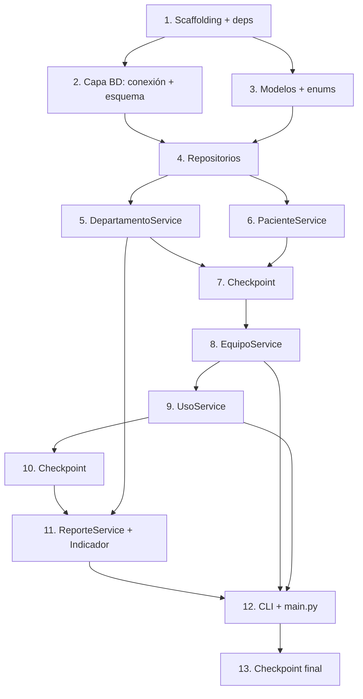

# Plan de Implementación: Sistema de Gestión de Equipos Médicos — Hospital Santo Tomás

## Overview (Enfoque de Implementación)

Se implementa una aplicación de consola en **Python 3.10+** con persistencia en **SQLite** (biblioteca estándar `sqlite3`), siguiendo la arquitectura en capas del diseño: **CLI → Servicios → Repositorios → Base de Datos**. La construcción es incremental y guiada por pruebas: primero se establece la base de datos y los modelos del dominio, luego se sube por capas (repositorios → servicios → CLI), añadiendo pruebas unitarias (`pytest` con SQLite en memoria) y pruebas basadas en propiedades (`hypothesis`) cerca de cada implementación para detectar errores temprano. Cada tarea se integra con las anteriores; no hay código huérfano.

Las 7 propiedades de corrección del diseño se validan mediante tareas de pruebas basadas en propiedades:
- **Propiedad 1** — Unicidad de códigos / cédulas / nombres.
- **Propiedad 2** — Integridad referencial.
- **Propiedad 3** — Estados válidos.
- **Propiedad 4** — Duración positiva.
- **Propiedad 5** — Orden no creciente del Indicador de Uso Clínico (incluye desempate determinista).
- **Propiedad 6** — Consistencia de la métrica de sesiones.
- **Propiedad 7** — Filtro de mantenimiento.

## Tasks

- [x] 1. Configurar la estructura del proyecto y las dependencias de desarrollo
  - Crear la estructura de paquetes: `hospital_equipos/` con `main.py` y los subpaquetes `db/`, `modelos/`, `repositorios/`, `servicios/`, `cli/`, cada uno con su `__init__.py`.
  - Crear el paquete de pruebas `tests/` con `__init__.py` y `tests/conftest.py` (fixture de conexión SQLite `:memory:` con esquema inicializado y `PRAGMA foreign_keys = ON`).
  - Añadir `requirements-dev.txt` con `pytest` y `hypothesis`; añadir `pytest.ini`/`pyproject.toml` con la configuración de pytest.
  - _Requirements: 11.1_

- [x] 2. Implementar la capa de base de datos (conexión y esquema)
  - [x] 2.1 Implementar la conexión SQLite y la inicialización del esquema
    - Crear `db/conexion.py` con `crear_conexion(ruta)` que abra la conexión, ejecute `PRAGMA foreign_keys = ON` y configure `row_factory = sqlite3.Row`.
    - Crear `db/esquema.sql` con el DDL de las 4 tablas (`departamentos`, `pacientes`, `equipos`, `uso_equipos`) incluyendo PK AUTOINCREMENT, restricciones `NOT NULL`, `UNIQUE` (nombre, cédula, codigo_inventario, numero_serie), `CHECK` de estado, `CHECK (duracion_minutos > 0)` y las claves foráneas (departamento_id, equipo_id, paciente_id). Incluir índice sobre `uso_equipos(equipo_id)`.
    - Implementar `inicializar_esquema(conexion)` que ejecute el DDL de forma idempotente (`CREATE TABLE IF NOT EXISTS`).
    - _Requirements: 10.4, 10.5, 10.6, 10.7, 10.8_

  - [x]* 2.2 Escribir pruebas unitarias para la conexión y el esquema
    - Verificar que `PRAGMA foreign_keys` está activo y que las 4 tablas existen tras inicializar.
    - Verificar que una inserción con FK inválida es rechazada por SQLite y que una duración `<= 0` viola el CHECK.
    - _Requirements: 10.4, 10.5, 10.8_

- [x] 3. Implementar los modelos del dominio y los enums
  - Crear `modelos/departamento.py`, `modelos/paciente.py`, `modelos/equipo.py` (con `Enum EstadoEquipo`) y `modelos/uso.py` como dataclasses según el diseño.
  - Crear el enum `CriterioUso` (SESIONES, HORAS) y la dataclass `MetricaUso` (equipo_nombre, departamento_nombre, total_uso, criterio).
  - _Requirements: 3.4, 4.2, 9.1, 9.2, 9.5_

- [x] 4. Implementar la capa de repositorios (SQL parametrizado)
  - [x] 4.1 Implementar `DepartamentoRepository` y `PacienteRepository`
    - Crear `repositorios/departamento_repo.py` con `insertar`, `obtener_por_id`, `obtener_por_nombre` (case-insensitive), `listar` — todo con SQL parametrizado (`?`).
    - Crear `repositorios/paciente_repo.py` con `insertar`, `obtener_por_id`, `obtener_por_cedula`, `listar` (ordenado por nombre ascendente).
    - _Requirements: 1.1, 1.7, 2.1, 2.4_

  - [x] 4.2 Implementar `EquipoRepository` y `UsoRepository`
    - Crear `repositorios/equipo_repo.py` con `insertar`, `obtener_por_id`, `obtener_por_codigo`, `actualizar`, `eliminar`, `listar_por_departamento`, `listar_por_estado`.
    - Crear `repositorios/uso_repo.py` con `insertar`, `listar_por_equipo` (ordenado por fecha_inicio descendente), `contar_por_equipo`, y `agregar_uso_por_equipo(criterio, departamento_id)` (SELECT con JOIN + GROUP BY + ORDER BY según el diseño).
    - _Requirements: 3.1, 6.1, 6.7, 7.1, 8.1, 9.1, 9.2_

  - [x]* 4.3 Escribir pruebas unitarias de round-trip para los repositorios
    - Insertar y recuperar filas de cada tabla verificando que los datos persisten intactos (parseo/serialización fila↔objeto).
    - _Requirements: 3.1, 6.1_

- [x] 5. Implementar `DepartamentoService` con validaciones y precarga
  - [x] 5.1 Implementar registro, consulta e inicialización de los 12 departamentos
    - Crear `servicios/departamento_service.py` con `registrar` (trim, longitud 1–100, unicidad case-insensitive), `listar`, `obtener`.
    - Implementar `inicializar_departamentos_base()` que precargue exactamente los 12 departamentos (incluido "Laboratorio Clínico y Banco de Sangre") solo si la tabla está vacía; omitir con mensaje si ya hay datos.
    - _Requirements: 1.1, 1.2, 1.3, 1.4, 1.5, 1.6, 1.7, 1.8, 10.3_

  - [x]* 5.2 Escribir prueba de propiedad de unicidad de nombres de departamento
    - **Property 1: Unicidad de códigos/cédulas/nombres**
    - **Validates: Requirements 1.4, 10.3**

  - [x]* 5.3 Escribir pruebas unitarias de DepartamentoService
    - Casos: nombre vacío/solo espacios, longitud > 100, duplicado case-insensitive, precarga de 12 y omisión en segunda invocación.
    - _Requirements: 1.2, 1.3, 1.5, 1.6_

- [x] 6. Implementar `PacienteService` con validaciones
  - [x] 6.1 Implementar registro y consulta de pacientes
    - Crear `servicios/paciente_service.py` con `registrar` (cédula 1–20 alfanumérica única, nombre 1–100, fecha de nacimiento válida no futura, género en {masculino, femenino, otro}, teléfono 7–15 dígitos), `listar` (orden por nombre), `obtener`.
    - _Requirements: 2.1, 2.2, 2.3, 2.4, 2.5, 2.6, 10.2_

  - [x]* 6.2 Escribir prueba de propiedad de unicidad de cédula
    - **Property 1: Unicidad de códigos/cédulas/nombres**
    - **Validates: Requirements 2.2, 10.2**

  - [x]* 6.3 Escribir pruebas unitarias de PacienteService
    - Casos: cédula duplicada, campos inválidos (fecha futura, género inválido, teléfono fuera de rango), listado ordenado y listado vacío.
    - _Requirements: 2.2, 2.3, 2.4, 2.5_

- [x] 7. Checkpoint — Asegurar que todas las pruebas pasan
  - Ensure all tests pass, ask the user if questions arise.

- [x] 8. Implementar `EquipoService` (alta, actualización, estado y baja con historial)
  - [x] 8.1 Implementar `registrar` con validaciones de integridad
    - En `servicios/equipo_service.py`: validar unicidad de código de inventario, existencia del departamento, estado dentro del enum, campos obligatorios y longitudes, fecha de adquisición válida no futura, estado por defecto "Operativo".
    - _Requirements: 3.1, 3.2, 3.3, 3.4, 3.5, 3.6, 3.7, 3.8, 10.1, 10.4, 10.7_

  - [x]* 8.2 Escribir prueba de propiedad de estados válidos
    - **Property 3: Estados válidos**
    - **Validates: Requirements 3.4, 10.7**

  - [x]* 8.3 Escribir prueba de propiedad de unicidad de código de inventario
    - **Property 1: Unicidad de códigos/cédulas/nombres**
    - **Validates: Requirements 3.2, 10.1**

  - [x]* 8.4 Escribir prueba de propiedad de integridad referencial equipo→departamento
    - **Property 2: Integridad referencial**
    - **Validates: Requirements 3.3, 10.4**

  - [x] 8.5 Implementar `actualizar` y `cambiar_estado`
    - Validar existencia del equipo, valores válidos (longitudes ≤ 255, obligatorios no vacíos) y estado dentro del conjunto; conservar datos previos ante rechazo.
    - _Requirements: 4.1, 4.2, 4.3, 4.4, 4.5, 10.7_

  - [x] 8.6 Implementar `dar_de_baja` preservando historial
    - Rechazar la baja si el equipo tiene sesiones asociadas (consultar `UsoRepository.contar_por_equipo`); rechazar si no existe o id inválido; tras baja exitosa, `obtener` devuelve vacío.
    - _Requirements: 5.1, 5.2, 5.3, 5.4, 5.5_

  - [x]* 8.7 Escribir pruebas unitarias de EquipoService (actualización, estado y baja)
    - Casos: actualizar equipo inexistente, estado inválido, baja con historial (rechazada), baja sin historial (exitosa), id inválido.
    - _Requirements: 4.3, 4.4, 4.5, 5.2, 5.3, 5.4_

- [x] 9. Implementar `UsoService` (registro de sesiones)
  - [x] 9.1 Implementar `registrar_uso` y `listar_por_equipo`
    - Crear `servicios/uso_service.py`: validar existencia de equipo y paciente, fecha/hora de inicio válida no futura, duración entera 1–1440; crear exactamente una sesión; listar por equipo ordenado descendente por fecha.
    - _Requirements: 6.1, 6.2, 6.3, 6.4, 6.5, 6.6, 6.7, 6.8, 10.5, 10.6, 10.8_

  - [x]* 9.2 Escribir prueba de propiedad de duración positiva
    - **Property 4: Duración positiva**
    - **Validates: Requirements 6.4, 10.8**

  - [x]* 9.3 Escribir prueba de propiedad de integridad referencial de sesiones
    - **Property 2: Integridad referencial**
    - **Validates: Requirements 6.2, 6.3, 10.5, 10.6**

  - [x]* 9.4 Escribir prueba de propiedad de conteo de sesiones
    - **Property 6: Consistencia de la métrica de sesiones**
    - Para N inserciones válidas de sesiones de un equipo, `contar_por_equipo` = N.
    - **Validates: Requirements 6.6, 9.1**

- [x] 10. Checkpoint — Asegurar que todas las pruebas pasan
  - Ensure all tests pass, ask the user if questions arise.

- [x] 11. Implementar `ReporteService` (consultas avanzadas y requisito crítico)
  - [x] 11.1 Implementar `inventario_por_departamento` y `alerta_mantenimiento`
    - Crear `servicios/reporte_service.py`: `inventario_por_departamento` (validar existencia y id válido, lista vacía si no hay equipos) y `alerta_mantenimiento` (solo estado "En mantenimiento").
    - _Requirements: 7.1, 7.2, 7.3, 7.4, 8.1, 8.2, 8.3, 8.4_

  - [x]* 11.2 Escribir prueba de propiedad del filtro de mantenimiento
    - **Property 7: Filtro de mantenimiento**
    - **Validates: Requirements 8.1**

  - [x] 11.3 Implementar `indicador_uso_clinico` (Indicador de Uso Clínico)
    - Calcular total por criterio SESIONES (conteo) u HORAS (suma de minutos / 60, redondeada a 2 decimales); filtrar por departamento opcional (validar existencia); ordenar de forma no creciente por total_uso con desempate alfabético ascendente por nombre de equipo; incluir nombre de equipo, departamento y total; validar criterio; devolver vacío sin error si no hay equipos en el alcance.
    - _Requirements: 9.1, 9.2, 9.3, 9.4, 9.5, 9.6, 9.7, 9.8, 9.9_

  - [x]* 11.4 Escribir prueba de propiedad del orden del indicador (con desempate determinista)
    - **Property 5: Orden del reporte**
    - Para cualquier historial de sesiones, el resultado está ordenado de forma no creciente por total_uso y, ante empates, alfabéticamente ascendente por nombre de equipo (orden determinista).
    - **Validates: Requirements 9.3, 9.4**

  - [x]* 11.5 Escribir prueba de propiedad de la métrica de sesiones del indicador
    - **Property 6: Consistencia de la métrica de sesiones**
    - El total_uso (criterio SESIONES) de cada equipo iguala el número real de sesiones insertadas.
    - **Validates: Requirements 9.1**

  - [x]* 11.6 Escribir pruebas unitarias del indicador (criterios y casos límite)
    - Casos: cálculo por HORAS con redondeo, filtro por departamento, departamento inexistente, criterio inválido, alcance vacío.
    - _Requirements: 9.2, 9.6, 9.7, 9.8, 9.9_

- [x] 12. Implementar la Interfaz de Menú de Consola (CLI) y conectar todas las operaciones
  - [x] 12.1 Implementar el menú principal y el enrutamiento de opciones
    - Crear `cli/menu.py`: menú numerado consecutivo desde 1 (departamentos, pacientes, equipos, sesiones, reportes, salir); invocar la operación asociada; mostrar resultados en formato campo/valor por línea; volver a mostrar el menú tras cada operación; manejar entradas inválidas/vacías sin invocar operaciones.
    - _Requirements: 11.1, 11.2, 11.3, 11.4_

  - [x] 12.2 Implementar captura de datos con reintentos y manejo de errores de servicio
    - Ante rechazo de un servicio por dato inválido, mostrar el dato y motivo, conservar los demás datos, solicitar solo el dato rechazado con hasta 3 reintentos; cancelar la operación al agotar los reintentos y volver al menú.
    - _Requirements: 11.5, 11.6_

  - [x] 12.3 Implementar `main.py` como punto de entrada e integración final
    - Crear conexión a `hospital.db`, inicializar esquema, precargar los 12 departamentos, instanciar repositorios y servicios, e iniciar el menú de consola (cableado completo de todas las capas).
    - _Requirements: 1.5, 11.1_

  - [x]* 12.4 Escribir pruebas unitarias de la CLI
    - Casos: selección inválida/no numérica/vacía, formato de salida campo/valor, flujo de reintentos y cancelación tras 3 intentos (simulando entrada).
    - _Requirements: 11.2, 11.4, 11.5, 11.6_

- [x] 13. Checkpoint final — Asegurar que todas las pruebas pasan
  - Ensure all tests pass, ask the user if questions arise.

## Task Dependency Graph (Grafo de Dependencias de Tareas)



## Notes (Notas)

- Las tareas marcadas con `*` son de pruebas (unitarias, de propiedad, de integración) y son opcionales; pueden omitirse para un MVP más rápido, aunque se recomienda ejecutarlas.
- Cada tarea referencia los requisitos específicos que valida para asegurar la trazabilidad.
- Las pruebas basadas en propiedades usan **hypothesis** con un mínimo de 100 iteraciones y referencian la propiedad del diseño; formato de etiqueta: **Feature: hospital-equipment-management, Property {número}: {texto}**.
- Las pruebas unitarias y de integración usan **pytest** con SQLite en memoria (`:memory:`).
- Los checkpoints (tareas 7, 10 y 13) garantizan validación incremental antes de subir de capa.
- Todo el acceso a datos usa SQL parametrizado; el requisito crítico (Indicador de Uso Clínico) se implementa en la tarea 11.3 y se valida con las propiedades 5 y 6.
```
