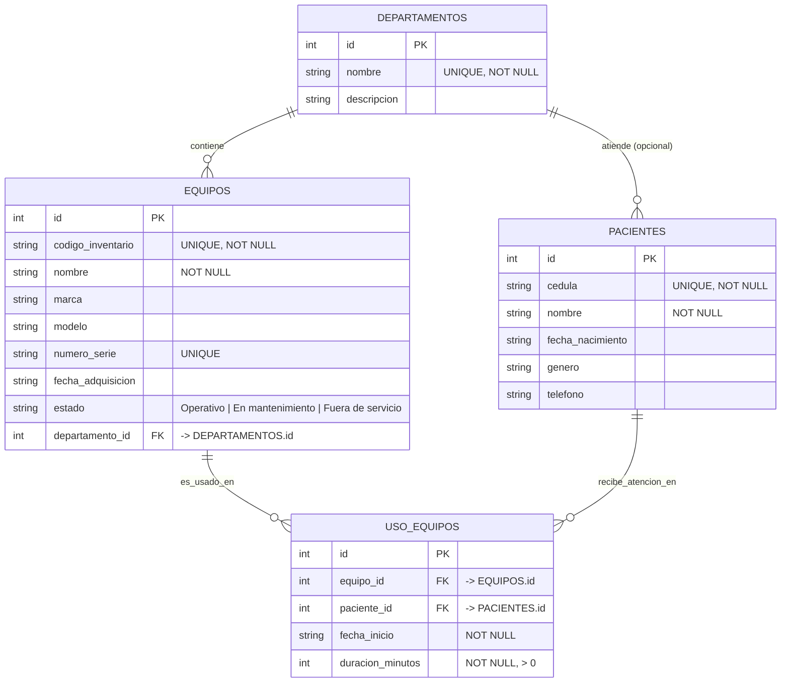
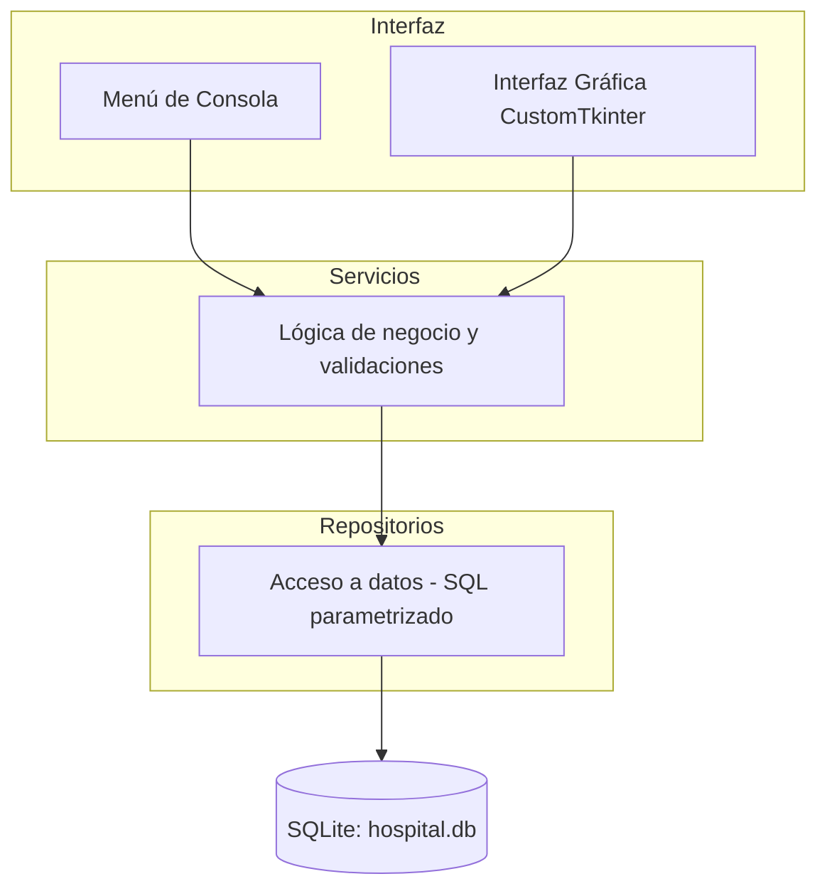

# Guía de Presentación y Defensa

## Sistema de Gestión de Equipos Médicos — Hospital Santo Tomás

> Documento de apoyo para la exposición y defensa del proyecto académico.
> Contiene todo lo necesario para presentar el sistema con claridad ante el profesor.

---

## 1. Portada / Resumen del proyecto

**Nombre del proyecto:** Sistema de Gestión de Equipos Médicos — Hospital Santo Tomás.

**¿En qué consiste?**
Es una aplicación desarrollada en **Python** con base de datos **SQLite** que permite
al hospital **controlar su inventario de equipos médicos**, registrar los
**departamentos** y **pacientes**, y llevar el control de las **sesiones de uso**
de cada equipo por parte de los pacientes. Además, incluye un módulo de reportes.

**¿Qué problema resuelve?**
El Hospital Santo Tomás necesita:

- Saber **qué equipos médicos posee**, dónde están (departamento) y en qué estado
  se encuentran (operativo, en mantenimiento o fuera de servicio).
- Registrar **cada uso** de un equipo por un paciente.
- Responder a una pregunta clave de gestión: **¿cuál es el equipo médico más
  utilizado por los pacientes, clasificado por departamento?** Esta métrica es el
  **Indicador de Uso Clínico**, el requisito crítico del proyecto, y sirve para
  tomar decisiones de compra, mantenimiento y distribución de recursos.

En resumen: el sistema sustituye el control manual (hojas de cálculo o papel) por
una solución con **base de datos relacional e integridad referencial**, evitando
datos duplicados o inconsistentes y ofreciendo reportes confiables.

---

## 2. Objetivos del sistema

1. **Gestión de departamentos:** registrar, listar y precargar los departamentos
   base del hospital.
2. **Gestión de pacientes:** registrar y consultar pacientes con validación de
   **cédula única**.
3. **Gestión del inventario de equipos:** operaciones completas del ciclo de vida:
   - **Alta** de un equipo (con código de inventario único).
   - **Actualización** de sus datos.
   - **Cambio de estado** (Operativo / En mantenimiento / Fuera de servicio).
   - **Baja** del equipo del inventario.
4. **Sesiones de uso:** registrar cada sesión de uso de un equipo por un paciente,
   validando referencias y duración positiva.
5. **Reportes y consultas avanzadas:**
   - Inventario por departamento.
   - Alerta de mantenimiento.
   - **Indicador de Uso Clínico** (equipo más usado por sesiones o por horas).

---

## 3. Tecnologías utilizadas

| Tecnología | Uso en el proyecto |
| --- | --- |
| **Python 3.10+** | Lenguaje principal (usa `match`, uniones de tipo `X | None`, `dataclasses`). |
| **SQLite** | Base de datos relacional embebida (incluida en la biblioteca estándar). |
| **Interfaz de consola (CLI)** | Menú de texto interactivo para operar el sistema. |
| **GUI con CustomTkinter** | Interfaz gráfica de escritorio moderna que reutiliza la misma lógica. |
| **pytest + Hypothesis** | Pruebas automáticas: unitarias y basadas en propiedades (**141 pruebas**). |

**Punto fuerte para la defensa:** la consola y la GUI **comparten la misma capa de
servicios y la misma base de datos**, por lo que no se duplica lógica de negocio.

---

## 4. Modelo de base de datos

El modelo relacional tiene **4 tablas** con integridad referencial (claves
primarias y foráneas):

| Tabla | Descripción | Clave primaria | Claves foráneas |
| --- | --- | --- | --- |
| `departamentos` | Departamentos del hospital. `nombre` único y obligatorio. | `id` | — |
| `pacientes` | Pacientes registrados. `cedula` única y obligatoria. | `id` | — |
| `equipos` | Inventario de equipos médicos. `codigo_inventario` único. | `id` | `departamento_id → departamentos.id` |
| `uso_equipos` | Sesiones de uso de un equipo por un paciente. | `id` | `equipo_id → equipos.id`, `paciente_id → pacientes.id` |

**Relaciones (en palabras):**

- Un **departamento** contiene muchos **equipos** (1 a N).
- Un **departamento** puede atender a muchos **pacientes** (1 a N, opcional).
- Un **equipo** se usa en muchas **sesiones de uso** (1 a N).
- Un **paciente** recibe atención en muchas **sesiones de uso** (1 a N).
- La tabla `uso_equipos` es la **tabla puente** que relaciona equipos y pacientes
  a través de cada sesión, guardando fecha de inicio y duración en minutos.

### Diagrama Entidad-Relación (ERD)



---

## 5. Arquitectura en capas

El sistema sigue una **arquitectura en capas** que separa responsabilidades:

```text
Interfaz (CLI / GUI)  →  Servicios  →  Repositorios  →  SQLite
```



**¿Por qué esta arquitectura?**

- **Separación de responsabilidades:** cada capa hace una sola cosa.
  - *Interfaz:* captura acciones del usuario y muestra resultados.
  - *Servicios:* valida datos y aplica las reglas del negocio (por ejemplo, el
    cálculo del Indicador de Uso Clínico).
  - *Repositorios:* encapsulan todas las sentencias SQL parametrizadas.
  - *SQLite:* almacena los datos con integridad referencial.
- **Reutilización entre consola y GUI:** ambas interfaces usan **exactamente los
  mismos servicios**, por lo que no se duplica la lógica ni las validaciones.
- **Testeabilidad:** al aislar la lógica de negocio, se puede probar sin depender
  de la interfaz.
- **Mantenimiento:** un cambio en el SQL solo afecta a los repositorios; un cambio
  en una regla solo afecta a los servicios.

---

## 6. Guion de demostración en vivo (paso a paso)

Sigue este orden para que la demostración tenga sentido (los datos dependen unos
de otros):

1. **Iniciar la aplicación.** Al arrancar crea `hospital.db` (si no existe), carga
   el esquema y precarga los departamentos base.
2. **Mostrar departamentos.** Entrar a la sección *Departamentos* y listar los
   departamentos precargados del hospital.
3. **Registrar un paciente.** Ir a *Pacientes* → registrar uno nuevo (cédula,
   nombre, fecha de nacimiento, género, teléfono). Mostrar que la **cédula debe
   ser única** (intentar repetir una y ver el rechazo).
4. **Registrar un equipo.** Ir a *Equipos* → alta de un equipo médico con
   `codigo_inventario` único, asignándolo a un departamento. Mostrar los **tres
   estados** posibles.
5. **Registrar sesiones de uso.** Ir a *Sesiones de Uso* → registrar varias
   sesiones del equipo con distintos pacientes y duraciones (en minutos).
   Registrar más sesiones a un equipo para que destaque en el reporte.
6. **Ejecutar el Indicador de Uso Clínico.** Ir a *Reportes* → generar el
   indicador **por sesiones** y luego **por horas**. Mostrar que el equipo con más
   uso aparece **de primero** y que se puede filtrar por departamento.
7. **Alerta de mantenimiento.** Cambiar el estado de un equipo a *En
   mantenimiento* y ejecutar la alerta de mantenimiento para ver que aparece en la
   lista.

> Consejo: prepara 2–3 equipos y varias sesiones **antes** de la exposición para
> que el reporte muestre un ranking claro y convincente.

---

## 7. Requisito crítico: Indicador de Uso Clínico

Es la funcionalidad más importante del proyecto: **determinar el equipo médico más
utilizado por los pacientes**.

**¿Cómo se calcula?** Se puede calcular con dos criterios:

- **Por sesiones:** cuenta cuántas veces se usó cada equipo (`COUNT`).
- **Por horas:** suma la duración de todas las sesiones de cada equipo y la
  convierte a horas (`SUM(duracion_minutos) / 60`).

**¿Qué muestra?** Una lista con: **nombre del equipo**, **departamento** al que
pertenece y el **total de uso** (número de sesiones u horas), **ordenada de mayor a
menor**. El primer elemento es el **equipo más usado**. Se puede filtrar por un
departamento específico o ver todos.

**¿Cómo se implementa?** El cálculo se delega a la base de datos usando **SQL con
`JOIN` + `GROUP BY` + `ORDER BY`**, que es más eficiente que procesarlo en memoria:

```sql
-- Criterio SESIONES: número de sesiones por equipo
SELECT e.nombre AS equipo, d.nombre AS departamento, COUNT(u.id) AS total_uso
FROM uso_equipos u
JOIN equipos e       ON e.id = u.equipo_id
JOIN departamentos d ON d.id = e.departamento_id
WHERE (:departamento_id IS NULL OR e.departamento_id = :departamento_id)
GROUP BY e.id
ORDER BY total_uso DESC;

-- Criterio HORAS: horas acumuladas por equipo
SELECT e.nombre AS equipo, d.nombre AS departamento,
       ROUND(SUM(u.duracion_minutos) / 60.0, 2) AS total_uso
FROM uso_equipos u
JOIN equipos e       ON e.id = u.equipo_id
JOIN departamentos d ON d.id = e.departamento_id
WHERE (:departamento_id IS NULL OR e.departamento_id = :departamento_id)
GROUP BY e.id
ORDER BY total_uso DESC;
```

- **`JOIN`** une las sesiones con su equipo y con el departamento del equipo.
- **`GROUP BY e.id`** agrupa las sesiones por equipo para poder sumarlas o contarlas.
- **`ORDER BY total_uso DESC`** ordena de mayor a menor, dejando arriba el más usado.

---

## 8. Calidad y pruebas

El proyecto tiene **141 pruebas automáticas** que combinan **pruebas unitarias**
(ejemplos y casos límite concretos) y **pruebas basadas en propiedades** (con
Hypothesis, que prueba muchas entradas aleatorias). Se ejecutan sobre una base de
datos SQLite **en memoria** (`:memory:`), por lo que no afectan los datos reales.

Aspectos de calidad verificados:

- **Integridad referencial:** todo equipo pertenece a un departamento existente y
  toda sesión referencia un equipo y un paciente existentes (`PRAGMA
  foreign_keys = ON`).
- **Unicidad:** códigos de inventario, cédulas de pacientes y nombres de
  departamentos no se pueden duplicar.
- **Estados válidos:** un equipo solo puede estar en uno de los tres estados
  permitidos (garantizado por un `CHECK` y por un `Enum`).
- **Duración positiva:** las sesiones exigen `duracion_minutos > 0`.
- **Orden del reporte:** el Indicador de Uso Clínico siempre queda ordenado de
  mayor a menor.
- **Seguridad (anti inyección SQL):** todas las sentencias usan **consultas
  parametrizadas** (placeholders `?`), nunca se concatenan cadenas del usuario.

---

## 9. Cómo ejecutar el proyecto

**Interfaz gráfica (GUI):**

- En Windows: **doble clic** en `ejecutar_app.bat` (instala dependencias y abre la app).
- Manualmente en cualquier sistema:
  ```bash
  python -m hospital_equipos.gui
  ```
  (en macOS/Linux también existe el lanzador `./ejecutar_app.sh`).

**Interfaz de consola:**

```bash
python -m hospital_equipos.main
```

**Ejecutar las pruebas automáticas:**

```bash
pytest
```

> Requisitos: **Python 3.10 o superior**. `sqlite3` viene incluido en Python. La
> GUI requiere un entorno con pantalla (display); la consola funciona siempre.

---

## 10. Posibles preguntas del profesor (con respuestas breves)

**¿Por qué eligieron SQLite y no otra base de datos?**
Porque es una base de datos **relacional embebida** que no requiere servidor
externo, viene incluida en Python y cumple con el requisito de claves primarias y
foráneas. Es ideal para una aplicación local del hospital.

**¿Cómo se garantiza la integridad de los datos?**
Con **claves foráneas** activadas (`PRAGMA foreign_keys = ON`), restricciones
`UNIQUE` y `NOT NULL`, un `CHECK` para los estados válidos, y validaciones
adicionales en la capa de servicios antes de insertar.

**¿Qué pasa al dar de baja un equipo que tiene historial de uso?**
Se **rechaza la baja** para **preservar el historial** de sesiones, que es
necesario para los reportes. Así no se rompe la integridad referencial ni se
pierden datos usados por el Indicador de Uso Clínico.

**¿Cómo se calcula el equipo más usado?**
Con una consulta SQL que hace `JOIN` entre sesiones, equipos y departamentos,
agrupa por equipo con `GROUP BY`, cuenta las sesiones (`COUNT`) o suma las horas
(`SUM`), y ordena de mayor a menor con `ORDER BY ... DESC`. El primero es el más
usado.

**¿Cuál es la diferencia entre las dos interfaces (consola y GUI)?**
La **consola** es un menú de texto; la **GUI** (CustomTkinter) es una ventana
gráfica con navegación, formularios y tablas. **Ambas usan la misma capa de
servicios y la misma base de datos**, así que hacen exactamente lo mismo; solo
cambia la forma de interactuar.

**¿Cómo evitan la inyección SQL?**
Usando **consultas parametrizadas** con placeholders `?`; los valores del usuario
nunca se concatenan directamente en el texto de la sentencia SQL.

---

## 11. Guion cronometrado sugerido (~10 minutos)

| Tiempo | Sección | Qué decir / mostrar |
| --- | --- | --- |
| 0:00 – 1:00 | Introducción | Nombre del proyecto, problema que resuelve y objetivos. |
| 1:00 – 2:00 | Tecnologías | Python, SQLite, CLI, GUI CustomTkinter, pruebas. |
| 2:00 – 3:30 | Modelo de datos | Explicar las 4 tablas y el diagrama Entidad-Relación. |
| 3:30 – 4:30 | Arquitectura | Capas Interfaz → Servicios → Repositorios → SQLite y su ventaja. |
| 4:30 – 7:00 | Demostración en vivo | Departamentos, paciente, equipo, sesiones, reporte, mantenimiento. |
| 7:00 – 8:30 | Indicador de Uso Clínico | Explicar el cálculo y el SQL (JOIN + GROUP BY + ORDER BY). |
| 8:30 – 9:15 | Calidad y pruebas | 141 pruebas, integridad, unicidad, seguridad anti inyección. |
| 9:15 – 10:00 | Cierre y preguntas | Resumen de logros y responder al profesor. |

---

> **Consejo final:** domina el flujo de la demostración (sección 6) y la
> explicación del Indicador de Uso Clínico (sección 7); son los dos puntos que más
> valora una defensa de este tipo de proyecto.
