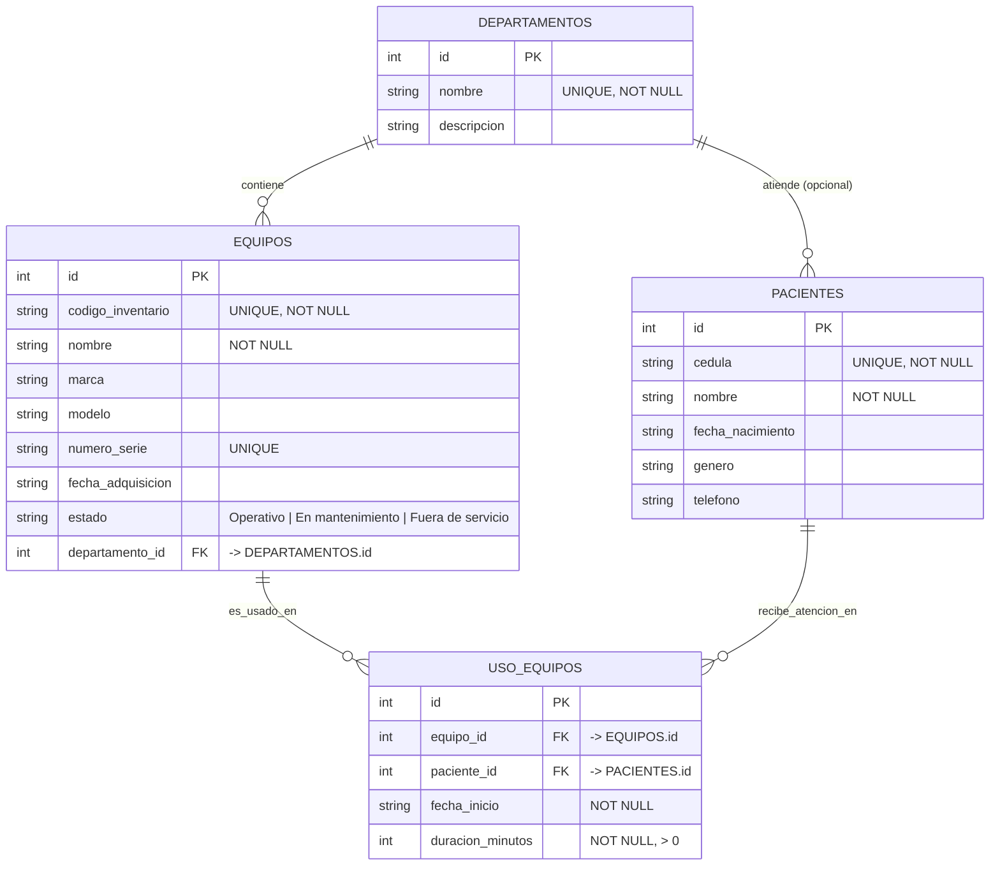

# Sistema de Gestión de Equipos Médicos — Hospital Santo Tomás

Aplicación de consola desarrollada en **Python** con base de datos **SQLite** que
permite gestionar el inventario de equipos médicos, los departamentos, los
pacientes y las sesiones de uso de los equipos. Incluye un módulo de reportes y
consultas avanzadas, entre ellas el **Indicador de Uso Clínico**, que determina
cuál es el equipo médico más utilizado (por número de sesiones o por horas
acumuladas), clasificado por departamento.

---

## Requisitos

- **Python 3.10 o superior** (se usan `match`, uniones de tipos `X | None` y `dataclasses`).
- `sqlite3`, incluido en la biblioteca estándar de Python (no requiere instalación adicional).

---

## Instalación

Se recomienda crear un entorno virtual e instalar las dependencias de desarrollo:

```bash
# Crear y activar el entorno virtual
python -m venv .venv
source .venv/bin/activate        # En Windows: .venv\Scripts\activate

# Instalar las dependencias de desarrollo (pytest, hypothesis)
pip install -r requirements-dev.txt
```

---

## Ejecución de la aplicación

```bash
python -m hospital_equipos.main
```

Al iniciarse, la aplicación crea la base de datos `hospital.db` (si no existe),
carga el esquema relacional y precarga los departamentos base del hospital.

---

## Interfaz Gráfica (CustomTkinter)

Además de la aplicación de consola, el sistema incluye una **interfaz gráfica de
escritorio moderna** construida con [CustomTkinter](https://customtkinter.tomschimansky.com/).
La interfaz **reutiliza la misma capa de servicios** que la consola (no duplica
lógica de negocio) y comparte la misma base de datos `hospital.db`, por lo que
ambos modos de uso son totalmente compatibles.

La ventana ofrece una barra lateral de navegación con las secciones
**Departamentos**, **Pacientes**, **Equipos**, **Sesiones de Uso** y
**Reportes** (incluido el **Indicador de Uso Clínico**), formularios de registro
con validación y tablas de resultados.

### Windows

- Opción sencilla: haga **doble clic** en el archivo `ejecutar_app.bat`. El
  lanzador instala automáticamente las dependencias (si faltan) y abre la
  aplicación.
- Opción manual, desde una terminal:

  ```bat
  pip install -r requirements.txt
  python -m hospital_equipos.gui
  ```

### macOS / Linux

- Opción sencilla, desde una terminal:

  ```bash
  ./ejecutar_app.sh
  ```

- Opción manual:

  ```bash
  pip install -r requirements.txt
  python -m hospital_equipos.gui
  ```

> Nota: la interfaz gráfica requiere un entorno con pantalla (display). La
> **versión de consola sigue funcionando** con `python -m hospital_equipos.main`.

---

## Ejecución de las pruebas

El proyecto cuenta con **141 pruebas**, que combinan **pruebas unitarias** y
**pruebas basadas en propiedades** (con [Hypothesis](https://hypothesis.readthedocs.io/)).
Para ejecutarlas:

```bash
pytest
```

Las pruebas usan una base de datos SQLite en memoria (`:memory:`), por lo que no
afectan a los datos reales de la aplicación.

---

## Estructura del proyecto

```text
new-project/
├── hospital_equipos/
│   ├── main.py                  # Punto de entrada; inicia el menú de consola
│   ├── db/                      # Conexión SQLite y esquema DDL (esquema.sql)
│   ├── modelos/                 # Dataclasses del dominio + enums
│   ├── repositorios/            # Acceso a datos (SQL parametrizado)
│   ├── servicios/               # Lógica de negocio y validaciones
│   ├── cli/                     # Menú de texto interactivo
│   └── gui/                     # Interfaz gráfica (CustomTkinter) + controlador
├── tests/                       # Pruebas unitarias y basadas en propiedades
├── ejecutar_app.bat             # Lanzador de la GUI para Windows
├── ejecutar_app.sh              # Lanzador de la GUI para macOS/Linux
├── requirements.txt             # Dependencias de ejecución (customtkinter)
├── pyproject.toml
└── requirements-dev.txt
```

---

## Arquitectura en capas

La aplicación sigue una **arquitectura en capas** que aísla responsabilidades y
favorece el mantenimiento y la testeabilidad:

```text
CLI (Presentación)  →  Servicios (Lógica de negocio)  →  Repositorios (Acceso a datos)  →  SQLite
```

- **CLI / GUI (Presentación):** el menú de texto y la interfaz gráfica (CustomTkinter) capturan las acciones del usuario y muestran los resultados. Ambas reutilizan exactamente los mismos servicios.
- **Servicios (Lógica de negocio):** validan datos, aplican reglas del dominio y coordinan operaciones (por ejemplo, el cálculo del Indicador de Uso Clínico).
- **Repositorios (Acceso a datos):** encapsulan todas las sentencias SQL parametrizadas y traducen entre filas y objetos del dominio.
- **SQLite (Base de datos):** almacena de forma persistente los datos con integridad referencial (claves primarias y foráneas).

---

## Modelo de datos

El modelo relacional está compuesto por **4 tablas** con integridad referencial:

| Tabla           | Descripción                                                                                          |
| --------------- | ---------------------------------------------------------------------------------------------------- |
| `departamentos` | Departamentos del hospital. `nombre` único y obligatorio.                                            |
| `pacientes`     | Pacientes registrados. `cedula` única y obligatoria.                                                 |
| `equipos`       | Inventario de equipos médicos. `codigo_inventario` único; pertenece a un departamento (FK).          |
| `uso_equipos`   | Sesiones de uso de un equipo por un paciente. Referencia equipo y paciente (FK); duración > 0.       |

### Diagrama Entidad-Relación



---

## Funcionalidades principales

- **Gestión de departamentos:** registro, listado y precarga de los departamentos base del hospital.
- **Gestión de pacientes:** registro y consulta de pacientes con validación de cédula única.
- **Gestión de equipos:** alta, actualización, cambio de estado y baja del inventario de equipos médicos, con código de inventario único e integridad referencial con el departamento.
- **Sesiones de uso:** registro de cada sesión de uso de un equipo por un paciente, validando existencia de referencias y duración positiva.
- **Inventario por departamento:** consulta del inventario de equipos de un departamento específico.
- **Alerta de mantenimiento:** listado de los equipos cuyo estado es "En mantenimiento".
- **Indicador de Uso Clínico:** reporte que identifica el equipo más utilizado (por número de sesiones o por horas acumuladas), ordenado de mayor a menor y clasificable por departamento.
